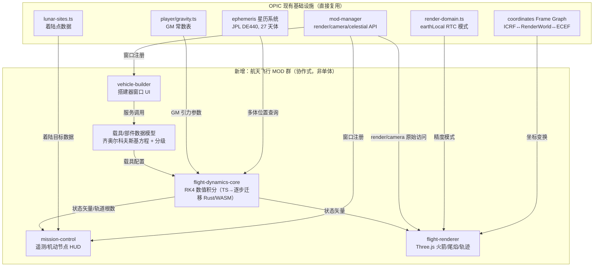

# OPIC 航天飞行 MOD：可行性评估、技术难点与实施方案

> 本文档基于对 `github.com/ChenXin-2009/OPIC` 仓库当前代码（非文档描述、非泛化假设）的实际检查得出。所有引用的路径、常量、阈值均来自实际源码，标注了"已具备  / 需新建  / 需验证 "三种状态，便于区分"已有基础"和"真正的新工作量"。

> **进度更新（2026-07-11）**：本文最初用于 Phase 0 前的可行性判断；截至当前仓库状态，`CESIUM_DOMINANT` 下 Three.js 叠加层逐帧渲染已由 `test/verify-threejs-overlay.ts` 验证通过，纯 TS 飞行动力学已扩展到推力 + 大气阻力 + 变质量 + 10,000× 子步保护，`Task 1.1`–`1.6` 与 `1.9` 已完成，`Task 1.8` 已部分完成。下文中保留的"需验证 / 需新建"描述应结合这条更新理解。

---

## 0. 总体结论

**可以做，而且比典型的"网页里塞一个 KSP"要现实得多** —— 原因不是 Three.js/Cesium 本身适合做飞行模拟（它们不是专门为此设计的引擎），而是 OPIC 在过去的开发中，为了做卫星追踪、月球探索、引力网格可视化，已经**顺带建好了轨道力学游戏最难的三块地基**：高精度多体星历、经过审计的坐标系 Frame Graph、以及一个权限完整的 MOD 插件系统。这三块东西如果是从零开始写，本身就是成本最高、最容易失控的基础工程。

但也要说清楚：**这仍然是一个大型工程**。真正缺的不是"能不能连接现有系统"，而是**火箭飞行本身的数值仿真核心**（变推力、变质量、大气阻力下的数值积分）、**载具/部件模型**、**搭建器 UI**——这些在 OPIC 里完全不存在，需要从零设计。规模上，这个 MOD 单独做完（含登月）大概率会超过 OPIC 主项目当前的复杂度。建议按第 4 节的阶段划分推进，其中"地球发射入轨"应被视为首个独立验收边界和继续投入的决策点。

还有一层贯穿全篇的约束需要提前说明：这个项目主要由 AI Agent 开发和维护，意味着每一块新功能"对不对"必须能被 AI 自己判断，不能依赖"跑起来、人肉眼看一眼"这种反馈方式——否则每次改动都要排队等人确认，AI agent 本可以连续迭代的速度会被拖成串行流程。飞行 MOD 里恰好有两类东西传统上最依赖人工判断：**物理效果**（轨道对不对、着陆稳不稳）和**视觉效果**（火箭有没有陷进地里、Cesium/Three.js 叠加层对不对齐、镜头跟得顺不顺）。第 3.9 节把这个约束具体落到了设计里，核心思路是把"看起来对"尽量转换成"数字断言"，把真正无法转换的主观判断（美术效果好不好看）压缩成一个很小、很低频的人工抽查环节，而不是让人工判断贯穿整个开发流程。

---

## 1. OPIC 现有基础设施盘点（这是本文档区别于通用方案的核心部分）

### 1.1 坐标系与参考系 ——  基本就绪，且是近期刚审计加固过的

`docs/coordinates/COORDINATE_SYSTEM_ALIGNMENT_PLAN.md`（审计版 v2，2026-06-19）和对应的 `IMPLEMENTATION_PROGRESS.md` 显示，OPIC 已经建立了一套明确的 **Frame Graph**，并且 8 个阶段中 7 个已经  完成、112/112 个坐标测试通过：

| 组件 | 路径 | 状态 |
|---|---|---|
| RenderWorld 定义（J2000 黄道，单位 AU） | `src/lib/coordinates/frames/ecliptic.ts` |  往返误差 < 1e-12 AU，37 个测试 |
| Cesium ICRF↔ECEF 桥接 | `src/lib/cesium/CameraSynchronizer.ts`（`computeIcrfToFixedMatrix`） |  唯一权威路径 |
| 卫星 TEME 帧 | `src/lib/coordinates/frames/teme.ts` |  |
| RTC（Relative-To-Center）精度模式 | `src/lib/coordinates/scale/render-domain.ts` |  `earthLocal` 域已定义 |
| 多体高精度星历（JPL DE440） | `src/lib/astronomy/ephemeris/` |  27 个天体，manager/interpolator/chunk-loader 齐全 |

**这对火箭 MOD 意味着什么**：飞船在地心惯性系下的位置、速度，最终都要转换到 RenderWorld 才能渲染——这条转换链路已经存在且经过测试，不需要重新发明。`render-domain.ts` 里已经定义了 `earthLocal` 渲染域：

```ts
earthLocal: {
  unitScale: 1 / 149597870.7,  // 米 → AU
  exitDistanceAU: 0.01,         // ≈ 1,495,979 km（覆盖到月球轨道之外）
  useRTC: true,                 // 卫星已经在用这个模式
}
```

这正是火箭在近地/地月转移阶段做物理积分应该使用的坐标系约定（地心惯性系，米为单位，RTC 方式渲染）——卫星渲染器已经用这套模式跑了很久，直接复用同一模式即可，不需要重新设计精度方案。

** 需要新建的部分**：`RENDER_DOMAINS` 目前只有 `earthLocal / solarSystem / nearbyStars / galaxy / supergalactic` 五个域，**没有 `moonLocal`**。飞船抵达月球附近、执行动力下降和着陆时，需要一个以月球为中心的 RTC 域（否则月面着陆阶段会退化到用 `solarSystem` 精度渲染厘米级的着陆过程，浮点误差会很明显）。这是对现有模式的直接复制扩展，工作量不大，但必须做。

### 1.2 引力常数与开普勒力学 ——  数据已具备， MVP 级双向能力已补齐

`src/lib/3d/player/gravity.ts` 已经包含（数据来源 NASA JPL Planetary Fact Sheet / JPL SSD）：

```ts
GM_KM3_S2 = {
  sun: 1.32712440018e11, earth: 3.986004418e5, moon: 4.902800066e3,
  mars: 4.282837e4, jupiter: 1.26686534e8, ... // 含木星/土星/天王星多颗卫星
}
```

`src/lib/astronomy/utils/kepler.ts` 与 `src/lib/astronomy/orbit/mechanics.ts` 已有 `solveKeplerEquation`、`eccentricToTrueAnomaly`、`heliocentricDistance`、`calculatePosition`。

**进度更新**：仓库现已在 `src/lib/flight-dynamics/kepler.ts` 中补齐 `stateToElements()` / `elementsToState()`，并在 `src/lib/flight-dynamics/integrator.ts`、`flight-integrator.ts` 中落地纯 TS RK4 与带推力飞行积分器。下面这段"关键限制"主要针对当时的初始盘点，现阶段仍然成立的缺口主要是 **Phase 2 级别的边界工况与机动节点能力**：

1. 状态矢量（位置+速度）↔ 轨道根数的**双向**转换基础版 —— **已具备 **，但还需要在圆轨道、逆行轨道、近抛物线等边界情况继续强化测试与 UI 消费链路
2. 变推力、变质量、有阻力时的**数值积分**（不是解析开普勒轨道传播）——**已具备 **，并已通过 Phase 0/1 自动化验证；后续扩展点转向 n-body、机动节点与姿态系统

这是整个项目里最核心的"真空区"，详见第 3.1 节。

### 1.3 MOD 插件系统 ——  能力远超"加个可视化图层"的预期

`src/lib/mod-manager/`（14 个子模块，`AGENTS.md` 有清单）提供的能力，经过实际读取 `RenderAPI.ts` 类型定义和 `gravity-grid` 这个**已上线 MOD** 的源码验证：

| 能力 | 接口 | 验证方式 |
|---|---|---|
| 直接拿到原始 Three.js 场景/相机/渲染器 | `context.render.getScene()/getCamera()/getRenderer()` | `gravity-grid/index.ts` 里实际 `scene.add(...)`、挂载 `TransformControls` |
| 每帧回调（物理积分循环的挂载点） | `context.render.onBeforeRender(cb)` | 同上，`gravity-grid` 用它每帧读取天体位置并更新渲染 |
| 自定义窗口（React 组件，VAB 风格搭建器可以做成这个） | `contributes.windows` + 组件导出 | `MOD_DEVELOPMENT_GUIDE.md` |
| 服务注册表（跨 MOD 调用） | `context.registerService/getService` | 可以把"飞行动力学核心"和"搭建器 UI"拆成两个协作 MOD |
| 事件总线 | `context.emit/on` | `gravity-grid` 用它做窗口开关 |
| 资源配额**可覆盖**（不是写死的） | `Sandbox.initialize(modId, quota?: Partial<ResourceQuota>)` | 读取 `sandbox/Sandbox.ts` 源码确认 `{...DEFAULT_QUOTA, ...quota}` 合并逻辑 |
| 直接读取 Zustand store（不是完全隔离沙箱） | `useSolarSystemStore.getState().celestialBodies` | `gravity-grid` 里直接 import 使用 |

**具体数字**：默认配额 `maxRenderObjects: 1000`、`maxMemoryMB: 50`，但 manifest 里的 `resourceQuota` 字段可以覆盖默认值（类型定义在 `mod-manager/types.ts:136`）。一枚多级火箭 + 部件网格 + 轨迹线 + 碎片，超过 1000 个渲染对象是有可能的（尤其是轨迹预测线用大量点段渲染时），需要在 manifest 里显式声明更高配额，这是**支持的**，不是障碍。

** 需要验证/新建的缺口**：
- `context.render.onBeforeRender(callback: () => void)` **不传 deltaTime**，物理循环需要自己维护时钟（工作量很小，但要注意）。
- `CameraAPI`（`mod-manager/types.ts:292`）的真实签名是 `cameraDistance / viewOffset / zoom / centerOnPlanet(name) / onCameraChange`——是一个"围绕命名天体的距离-偏移-缩放"模型，**不支持自由 6 自由度跟随任意动态对象**。`centerOnPlanet` 只接受天体名字，飞船不是天体。这意味着火箭的"追踪镜头"大概率要绕过高层 CameraAPI，直接操作 `context.render.getCamera()` 拿到的原始 `THREE.Camera`（`gravity-grid` 已经证明这条路径可行）。**这是一个文档（`MOD_DEVELOPMENT_GUIDE.md` 里写的 `flyTo`/`lookAt`/`getPosition`/`getTarget`）与实际代码不一致的地方**——那些方法在真实的 `CameraAPI` 接口里不存在，设计时不要依赖文档描述，以 `types.ts` 为准。
- `CesiumLayerOptions.type` 只有 `'imagery' | 'terrain'` 两种，**MOD 系统没有暴露 Cesium 原生 Entity/Primitive 接口**，也没有 `getCesiumViewer()`。见 1.4 节，这个缺口有绕过方案。

### 1.4 双引擎切换的真实实现（比文档描述精确得多，这一点很重要）

`docs/ARCHITECTURE.md` 写的是"< 0.1 AU → Cesium 模式"，但**实际代码**（`src/lib/3d/SceneModeManager.ts`）是这样的：

```ts
const DEFAULT_CONFIG = {
  cesiumModeDistanceThreshold: 0.000076,  // ≈ 距地心 11,369 km（海拔 ≈ 4,991 km）
  threeModeDistanceThreshold: 0.000096,   // ≈ 距地心 14,361 km（滞回区间防抖）
  transitionDuration: 0,                   // 即时切换，不是文档说的"淡入淡出"
};
```

换算成实际意义：**只有海拔 0～约 5,000 km 这一段（发射到低轨/中轨早期）会处于 `CESIUM_DOMINANT` 模式**；一旦超过约 8,000 km 海拔（GEO、地月转移轨道、月球，全部远超这个阈值），场景切回 `THREE_DOMINANT`。月球本身距地心约 384,400 km（0.00257 AU），远超两个阈值，全程都在 Three.js 主导模式下——**登月阶段不涉及 Cesium 渲染问题，只有发射与低轨爬升那一段需要处理**。

更关键的一点：模式名称是 `THREE_DOMINANT`（Three.js 为主场景，Cesium 作为"嵌入元素"）和 `CESIUM_DOMINANT`（反过来）——**不是"二选一互斥"，而是两个 canvas 通过 CSS 层叠共存**（`cesium-canvas-overlay.*.test.ts` 验证了 Cesium canvas 是 `z-index: 2` 的覆盖层，不是纹理烘焙进 Three.js）。

**这意味着**：理论上，一枚在 `earthLocal` RTC 域里正确计算出位置的火箭网格，通过 MOD 的 `registerRenderer` 加入 Three.js 场景后，**在 `CESIUM_DOMINANT` 模式下也应该能叠加显示在真实地球影像之上**——因为 Three.js 层并没有被杀死，只是变成"嵌入元素"。这如果成立，就绕开了 1.3 节提到的"MOD 拿不到 Cesium 原生渲染接口"的问题，不需要扩展 Cesium 那一侧的 API。

**更新（2026-07-11）**：这条风险已经由 Phase 0 Task 0.1 的程序化验证消除。`test/verify-threejs-overlay.ts` 在 `CESIUM_DOMINANT` 模式下连续推进 8 帧，确认 `render()` 调用次数 = 帧数；后续 `Task 1.6` 也已在此结论基础上落地火箭网格、尾焰与轨迹线的场景图断言脚本 `test/verify-flight-renderer.ts`。

### 1.5 现成可复用的"零件"

| 资产 | 路径 | 对火箭 MOD 的价值 |
|---|---|---|
| 真实的月球着陆点数据库 | `src/lib/astronomy/lunar-sites.ts`（阿波罗 11/12/14/15/16/17、勘测者 1/3、月球 9 号、嫦娥 3/4/5 号，均带真实月面坐标） | 直接作为"选择着陆目标"UI 的候选点/参照系，"落点精度打分"可以直接算与这些历史点的距离 |
| 月面标记渲染器 | `src/lib/3d/MoonSiteMarkers.ts`（159 行，非占位代码） | 复用同一套"在天体表面标记一个经纬度坐标"的渲染模式，登月目标选择 UI 可以直接用这个模式 |
| 引力场计算的真实先例 | `src/lib/mods/gravity-grid/GravityFieldCalculator.ts` | 已经在做"读取多天体位置、求和引力效应"这件事，是多体引力仿真在这个代码库里的第一个真实先例 |
| Rust→WASM→Worker 的完整范式 | `rust-sgp4/`（`Cargo.toml` + `lib.rs`）+ `public/wasm/opic_sgp4_*` + `public/workers/sgp4.*.worker.js` | 见 3.1 节，新的物理引擎 crate 直接照抄这个范式 |
| "自由飞行"输入映射（WASD→推力/平移/偏航/俯仰/横滚/加速） | `src/lib/3d/player/PlayerInput.ts` | 已提供可复用的输入状态采集层，但**目前没有任何消费者**（搜索确认它没被任何控制器/物理循环调用）；更适合作为火箭控制适配层的输入来源，而不是原样直接充当火箭控制方案 |
| 程序化验证脚本范式 | `test/verify-backend.ts` 等（``/`` 结构化输出，AI agent 可直接跑脚本读退出信息，不需要看截图） | 与你在其他项目中强调的"新功能必须有非视觉、程序化反馈"的架构约束完全一致，第 3.9 节会具体展开怎么把这个约束落到火箭物理引擎上 |
| 属性测试库已在依赖中 | `package.json` → `fast-check ^4.4.0`（devDependencies） | 非常适合验证物理不变量（能量守恒、角动量守恒），见 3.9 节 |

### 1.6 明确不存在、需要从零建的部分

为了不留模糊地带，这里直接列清单（这些不是"某个文件写得不好"，是真的没有）：

- 数值 ODE 积分器（RK4/RK45 等）——搜索仓库内 `KEPLER_TOLERANCE` 相关调用，只找到解析开普勒传播，没有任何数值积分代码
- 状态矢量↔轨道根数双向转换
- 火箭方程（Tsiolkovsky）/ 分级 / 载具部件质量模型
- 大气模型（进而阻力、动压）
- 引力影响球（SOI）判定与坐标系切换逻辑，或者 n-body 数值积分（二选一，见 3.2 节）
- 发射场坐标数据库（Cape Canaveral、拜科努尔、库鲁、酒泉、文昌等）——`package.json`/`src` 中搜索无结果，好在这只是静态数据，模式可以照抄 `lunar-sites.ts`
- 载具搭建器 UI（VAB 风格）
- `moonLocal` RTC 渲染域（1.1 节提到）

---

## 2. 这个 MOD 到底在解决什么问题（范围界定）

用户操作链条：**选发射场（地球表面） → 搭建火箭（选部件、分级） → 发射 → 上升段（穿越大气）→ 入轨 → （可选）机动/转移 → 抵达月球或其他行星 → 下降/着陆**。

对应到工程模块，大致是：

1. 载具建模（部件目录、质量、推力、Isp、气动系数）
2. 飞行动力学（数值积分：引力 + 推力 + 阻力 → 状态矢量演化）
3. 制导与操控（键盘/UI 控制推力方向、节流阀、分级）
4. 轨道显示与规划（当前轨道根数、机动节点、转移轨道预览）
5. 渲染（火箭模型、尾焰、轨迹线、目标点标记）
6. 搭建器与任务控制 UI
7. 与 OPIC 现有坐标/星历/MOD 系统的对接

---

## 3. 核心技术难点逐项分析

### 3.1 飞行动力学数值积分核心 —— 全项目最大的"新建"工作量

**问题**：开普勒轨道传播（现有代码）假设轨道根数不随时间变化，只是在已知椭圆上找某时刻的位置。火箭在动力飞行阶段，轨道根数**每一帧都在变**（推力在改变速度矢量，燃料消耗在改变质量，大气在制造阻力）。这不是"换个函数"的问题，是完全不同的数值方法：需要对运动方程

```
d(position)/dt = velocity
d(velocity)/dt = Σ(GM_i · (r_i - position) / |r_i - position|³) + F_thrust/mass + F_drag/mass
d(mass)/dt = -F_thrust / (Isp · g0)   （仅在发动机点火时）
```

做数值积分（推荐 **RK4 定步长**作为第一版——游戏级精度足够、实现简单、性能可预测；未来如果要支持长时间无推力滑行的高精度轨道预报，可以引入自适应步长的 RK45 或辛积分器，但那是优化项不是 MVP 必需项）。

**推荐实现位置**：仿照 `rust-sgp4/` 的既有范式——新建一个 Rust crate（比如 `rust-flight-dynamics`），`Cargo.toml` 直接复制现有的依赖组合思路（`wasm-bindgen` + `serde`/`serde_json` + `console_error_panic_hook`，`crate-type = ["cdylib"]`，`opt-level = "s"` + `lto = true`），暴露类似这样的接口：

```rust
#[wasm_bindgen]
pub fn integrate_step(state_json: &str, controls_json: &str, dt: f64) -> String
// 输入：当前状态矢量 + 载具参数 + 控制输入（节流/姿态）+ 步长
// 输出：下一状态矢量（JSON），供 JS 侧解析
```

跑在专属 Web Worker 里（同样照抄 `sgp4.wasm.worker.js` 的消息传递模式），主线程通过 `context.render.onBeforeRender` 每帧读取 worker 回传的最新状态用于渲染，物理子步进在 worker 内部自行控制（避免主线程掉帧时物理跟着变慢/加快）。

**一个务实的分阶段建议**：不必一开始就上 Rust。仿照这个仓库里 SGP4 本身的演化路径（先有纯 JS 的 `sgp4.worker.js`，后来才加了 Rust/WASM 版本）——**Phase 1 可以先用纯 TypeScript 实现 RK4**，验证力学模型对不对、手感对不对，等确定要长期维护、且性能确实成为瓶颈时，再把积分器热路径迁移到 Rust/WASM。这样可以更快看到"能不能玩"的反馈，避免过早优化。

### 3.2 关键设计决策：Patched Conics（分段圆锥曲线，KSP 的做法）vs 完整数值 n-body

这是一个真正需要你拍板的架构选择，不是"标准答案"，两条路都能走通：

| | Patched Conics（KSP 方式） | 数值 n-body（Cowell 方法） |
|---|---|---|
| 原理 | 滑行段用解析开普勒公式（快），只在燃烧段和 SOI 边界数值积分 | 全程数值积分，引力源项来自多个天体叠加 |
| 性能 | 更省 CPU（滑行段几乎零开销） | 单个飞行器的 n-body 积分其实很便宜（只是"一个轻质点在几个已知位置天体的引力场中运动"，不是真正意义上"多体互相影响"的昂贵 n-body），性能不是真正的顾虑 |
| 需要新建的东西 | SOI 半径定义、SOI 穿越检测、参考系切换逻辑（KSP 历史上这块出过不少"边界抖动"类 bug，是出了名的难调） | 不需要 SOI patching，天然处理弱稳定边界轨道、地月三体效应 |
| 与 OPIC 现状的契合度 | 需要新写一套 SOI 逻辑，且**不复用**已有的高精度星历优势 | **直接复用** `src/lib/astronomy/ephemeris/` 现成的地球/月球/太阳任意时刻精确位置——这是 OPIC 独有的优势，大多数从零开始的轨道游戏没有这个 |
| 真实感/教学性 | 玩家熟悉（如果目标用户玩过 KSP） | 概念更统一，对"为什么轨道会被月球引力轻微拉扯"这类现象的呈现更自然 |

**建议**：鉴于 OPIC **已经**建好了一套 JPL DE440 级别的高精度星历（这在其他同类项目里通常是最耗时的部分），**数值 n-body 积分是更顺理成章的选择**——直接在每个积分步里查询星历拿到地球/月球/太阳当前精确位置，作为引力源项求和，不需要另外实现和调试 SOI 判定与坐标系切换。代价是全程都在做数值积分（哪怕在稳定轨道上滑行也不能"抄近道"用解析公式），但如 3.1 节所说，这个计算量对单个飞行器而言并不昂贵。如果未来接入多飞行器/空间站等场景，可以再评估是否需要分段优化。

### 3.3 大气与气动阻力（仅地球上升段需要）

不需要复杂 CFD。标准做法是指数大气模型：

```
ρ(h) = ρ₀ · exp(-h / H)     // 地球：ρ₀ ≈ 1.225 kg/m³，H（标高）≈ 8500 m
F_drag = 0.5 · ρ(h) · v² · Cd · A
```

每个部件带一个 `dragCoefficient` 和 `crossSectionArea`，这是标准游戏级简化，KSP 本身也是类似做法（更精细的版本会考虑马赫数相关的 Cd，属于锦上添花项）。月球没有大气，这部分逻辑对登月段直接跳过。

### 3.4 载具与部件模型

需要新建一套数据驱动的部件目录，大致形状：

```ts
interface RocketPart {
  id: string;
  type: 'engine' | 'fuelTank' | 'decoupler' | 'capsule' | 'parachute' | 'structural';
  dryMassKg: number;
  thrustVacuumN?: number;      // 发动机
  ispVacuumS?: number;
  propellantMassKg?: number;   // 燃料罐
  dragCoefficient: number;
  crossSectionAreaM2: number;
}
```

分级 Δv 用齐奥尔科夫斯基火箭方程 `Δv = Isp · g0 · ln(m0/m1)` 逐级计算，这是标准公式，实现本身不难，难点在于**搭建器 UI 的交互设计**（部件如何吸附、如何可视化分级、如何实时算出预估 Δv/推重比）——这是一块独立的、相当可观的前端工程量，和物理引擎本身的难度是两回事，在任务拆分与资源评估时应单独核算。

### 3.5 输入与操控

`PlayerInput.ts` 已经提供了六轴输入状态与 `boost` 标志位，但它当前的语义是"自由飞行"而不是"火箭控制"：`thrust/strafe/lift` 更接近平移轴，`yaw/pitch/roll` 则可直接映射到姿态控制，而且目前**没有任何代码在消费它**（我在仓库里搜索确认了这一点）。因此更合理的做法不是"原样直接复用"，而是新增一个"飞行控制器"适配层，把现有输入状态重新解释为火箭的节流、姿态与分级控制；必要时再小幅扩展按键映射，但不应假设 `PlayerInput` 现状已经满足火箭控制需求。UI 层面还需要新增：分级触发键、SAS（姿态锁定）开关、时间加速控制（复用 `TimeAPI.setTimeSpeed`，这个已经存在）、机动节点编辑器（新建）。

### 3.6 相机

如 1.3 节所述，公开的 `CameraAPI` 是"围绕命名天体"的模型，不适合追踪玩家造的飞行器。建议直接用 `context.render.getCamera()` 拿到原始 `THREE.Camera` 做自定义追踪相机（`gravity-grid` 已验证这条路径的可行性），自行实现"跟随+可自由环绕"的第三人称/轨道相机逻辑。这部分是常规 Three.js 工程问题，不涉及 OPIC 特有的复杂度。

### 3.7 渲染与坐标接入

近地/大气层内：Three.js 网格 + `earthLocal` RTC 域，参照卫星渲染器的既有模式。是否能在 `CESIUM_DOMINANT` 模式下正确叠加显示——见 1.4 节，这是需要第一时间验证的风险项。地月转移段：仍应以 `earthLocal` 作为主要近场积分与渲染域，直到接近月球后再切入新建的 `moonLocal`；`solarSystem` 更适合作为远景观察或非近场对象的显示域，而不应承担近月操作和着陆精度要求。月面着陆段：必须引入 `moonLocal` RTC 域（1.1 节），并为地月域切换补充连续性测试。

### 3.8 与 MOD 系统的集成方式

建议**不要**把整个火箭系统做成一个巨大的单体 MOD，而是利用现有的服务注册表机制拆成几个协作 MOD（这也更符合 `ARCHITECTURE.md` 里"核心保持最小，一切可选功能都是插件"的既定设计哲学）：

- `flight-dynamics-core`：物理引擎（worker + wasm），通过服务注册表暴露 `IFlightDynamicsService`
- `vehicle-builder`：搭建器窗口 UI，消费上面的服务算 Δv/推重比预览
- `mission-control`：飞行中的 HUD/遥测/机动节点窗口
- `flight-renderer`：Three.js 渲染层（火箭网格、尾焰、轨迹线）

Manifest 需要的权限大致是 `render:*`、`camera:read`、`celestial:read`、`time:read`、`time:write`（时间加速）、`events:*`、`storage:write`（保存载具设计/存档）。`resourceQuota` 需要显式声明更高的 `maxRenderObjects`（轨迹预测线、碎片、多级部件加起来容易超过默认的 1000）。

### 3.9 可验证性架构：让 AI Agent 能独立验收物理与视觉正确性

这一节的前提判断很直接：这个项目主要由 AI Agent 开发，"跑起来、人肉眼确认一下"这种验收方式在这里几乎不可行——不是人不愿意做，而是每次改动都要排队等人来看一眼，会把 AI agent 原本可以连续迭代的速度拖成"一次改动、一次人工确认"的串行流程。飞行 MOD 里最容易掉进这个坑的恰好是两类东西：**物理效果**（轨道算得对不对、有没有在高倍时间加速下发散、着陆稳不稳）和**视觉效果**（火箭有没有陷进地表、Cesium/Three.js 两层有没有对齐、追踪镜头跟得顺不顺）。下面按这两类分别给出可以完全自动化的验证方法，第三部分处理真正压缩不掉的主观判断。

#### 3.9.1 物理正确性——转换为数字断言

延续这个项目里"新功能必须有非视觉、程序化反馈"的既定要求（见 1.5 节 `test/verify-backend.ts` 的先例），建议按同样风格新建 `test/verify-flight-dynamics.ts`，覆盖：

- **已知解析解回归**：给定纯引力、无推力的初始状态，积分若干轨道周期后，用解析二体公式算出的位置做基准，误差应在容差内收敛（而不是发散）——这是判断积分器"没写错"的最基本测试，不需要任何渲染
- **守恒量属性测试**（用仓库里已有的 `fast-check`）：纯引力滑行时机械能与角动量应在浮点误差范围内守恒；四元数积分后范数应始终 ≈ 1（不应随时间漂移）——这类属性测试自动生成大量随机初始状态去"找茬"，比手写几个固定用例更可靠，而且完全是数值比较
- **已知任务基准**：例如给定霍曼转移的解析 Δv 公式结果，验证数值积分器执行同样机动后达到的目标轨道参数是否吻合
- **单帧步进上限测试**：验证高倍时间加速（10×/100×/10,000×）时子步数有上限、不会因为单帧算太多步导致掉帧或数值爆炸——这是最初版本里提到的"时间加速摧毁数值积分"风险点的直接对应测试

这套脚本可以让 AI agent 在不启动浏览器、不用肉眼看画面的情况下，直接用 ``/`` 输出判断"这次物理引擎改动有没有破坏轨道力学正确性"。

#### 3.9.2 视觉/渲染正确性——把"看起来对"转换成"场景图数值断言"

物理层可以完全不看画面就验证，但视觉层（火箭是不是真的贴在发射台上、Cesium 叠加层是不是真的对齐、追踪镜头是不是真的在跟）传统上被认为必须靠人眼判断。实际上大部分情况可以拆成两层：

1. **场景图数值断言（优先，成本最低，AI 可以完全独立跑）**：Three.js 的每个 `Object3D` 都能用 `getWorldPosition()` / `getWorldQuaternion()` 拿到世界坐标系下的精确数值。渲染层的职责应该被限制成一个**纯函数**：输入是物理引擎吐出的状态矢量，输出是 `Object3D` 的 `position`/`quaternion`，中间不夹杂额外逻辑。这样验证"火箭是不是贴在发射场地面上"就不需要看画面，而是：拿发射场的真实测绘坐标（经纬度+海拔）算出预期世界坐标，跟渲染层实际算出的 `getWorldPosition()` 做数值比较，误差应在厘米级容差内。同样的方法可以用在着陆验证上（火箭底部世界坐标应等于该经纬度下的地形高度，误差在着陆腿长度容差内，且不能是负值——负值意味着穿模进地下）。1.4 节提到的"`CESIUM_DOMINANT` 模式下 Three.js 层是否每帧重绘"，同样可以用渲染计数器这种非视觉的调用层面断言解决，不需要看画面。
2. **Headless 截图 diff（次要防线，兜住场景图断言覆盖不到的东西）**：对于场景图断言覆盖不到的问题（比如尾焰粒子形状是否合理、载具网格有没有明显穿插），用 Playwright 起一个无头 Chromium，固定相机角度/时间/随机种子，截一张图，跟仓库里存的"基准图"做像素级 diff（`pixelmatch` 或类似库），diff 分数超过阈值就判定失败。这一层比场景图断言脆弱（光照、抗锯齿的微小变化都会造成 diff），所以只用来做回归检测（"这次改动是不是意外改变了渲染结果"），不用来证明"渲染在数学上是对的"——数学正确性交给场景图断言和 3.9.1 的物理断言。

按这个思路，1.4 节里"肉眼确认能不能叠加、跟随"这一步，可以完全用渲染计数器 + 场景图数值断言替代，AI agent 自己就能跑完整个 Phase 0 spike 的验收，不需要打开浏览器看画面。

#### 3.9.3 真正压缩不掉的部分——如何把人工介入面缩到最小

有一小部分东西确实是纯主观判断，比如"尾焰特效好不好看""这个镜头运镜手感舒不舒服"，目前没有办法完全交给 AI 自动判断对错，但可以把人工介入的**频率**和**成本**降到最低，而不是让它贯穿整个开发流程：

- 对这类主观效果，可以用带视觉能力的模型做**初筛**（拿渲染截图跟几张参考图做语义/结构层面的比对，判断"大致像不像一个正常的火箭尾焰"），只有初筛结果模糊或明显不对时才升级给人看，把人工审查从"每次改动都要看"压缩成"偶尔抽查一次"
- 对必须要人看的场景，固定一组"黄金截图"场景（固定发射场、固定时间、固定相机角度），每次改动后自动生成对比图，人只需要扫一眼这组固定截图，而不是完整玩一遍整个飞行流程
- 明确写进 MOD 开发规范：任何新功能提交前，先过 3.9.1/3.9.2 的自动化断言，两层都通过之后才值得让人做最后的主观体验确认——人工判断永远是"最后一道、频率很低的关卡"，而不是"每次改动的第一道、也是唯一的关卡"

这三小节合起来，构成这个 MOD 相对于 OPIC 主项目一个新增的、明确的架构要求：**渲染层必须是纯函数、物理状态必须可以脱离渲染单独验证、真正主观的东西要靠固定黄金样本和视觉模型初筛去压缩人工频率**——而不是像很多游戏项目那样，默认"物理效果和视觉效果就是得靠人玩一遍才能确认"。

---

## 4. 推荐架构



---

## 5. 分阶段实施计划

| 阶段 | 目标 | 关键交付物 | 验收关注点 |
|---|---|---|---|
| **Phase 0：验证型 Spike** | 排除最大的两个未知数 | ① 用渲染计数器 + 场景图数值断言（3.9.2 节）程序化验证 `CESIUM_DOMINANT` 模式下 Three.js 叠加渲染是否每帧更新，不依赖人眼确认；② 纯 TS 写一个最小二体 RK4 积分器，配套 `verify-flight-dynamics.ts` 的解析解回归测试（3.9.1 节），跑通"发射→入轨"最简流程，用 ``/`` 脚本验证数值方法本身没问题 | 两项验证都应产出可被 AI agent 直接读取退出码/输出的脚本，而不需要人跑开发服务器看画面；同时明确后续渲染方案是否需要走"强制锁定 Three 模式"的退路 |
| **Phase 1：地球发射入轨（MVP）** | 从选定发射场起飞，进入稳定地球轨道 | 发射场静态数据库（仿照 `lunar-sites.ts` 模式）、精简部件目录（5-10 个部件）、纯 TS 二体+阻力积分器、极简搭建器（部件堆叠，非拖拽）、基础遥测 HUD、`verify-flight-dynamics.ts` 验证脚本（3.9.1 节）、场景图数值断言脚本验证载具渲染位置与发射场测绘坐标吻合（3.9.2 节） | 应作为第一个完整可玩、可独立验收的功能边界；验收标准以 3.9 节的自动化断言为主，人工体验确认作为最后一道低频关卡 |
| **Phase 2：轨道机动** | 机动节点（顺行/逆行/法向/径向）、轨道根数实时显示 | 状态矢量↔轨道根数转换（3.1 节提到的缺口）、机动节点 UI | 重点关注轨道参数双向转换精度、机动节点预览与执行结果的一致性 |
| **Phase 3：地月转移与登月** | 从地球轨道飞到月球并着陆 | n-body 积分（复用现有星历，3.2 节）、`moonLocal` RTC 域、动力下降物理、复用 `lunar-sites.ts`/`MoonSiteMarkers.ts` 做目标选择与落点打分 | 重点关注地月域切换连续性、近月渲染精度，以及落点评分闭环是否完整 |
| **Phase 4：扩展** | 性能优化 + 其他天体 | 积分器热路径迁移 Rust/WASM（若 Phase 1-3 显示有必要）、扩展到火星等（现有星历已覆盖全部 27 个天体，理论上是同一套 n-body 代码直接适用）、更多部件、失败模式（结构极限、燃料耗尽熄火）、返回/再入 | 以性能瓶颈、玩法扩展价值和验证体系可复用性为主要决策依据 |

---

## 6. 与你之前探索的商业方向的一个连接点

你此前评估过月球开发 / 地月商业基础设施方向（CLT 实现、转移窗口 API、着陆点评分），这个飞行 MOD 里天然会实现的两块能力——**转移窗口/轨道计算**和**着陆点评分**——本质上和那个商业 API 构想是同一套底层逻辑。换句话说，这个 MOD 除了是一个好玩的功能，也可能成为那个 B2B API 方向的一个可玩、可演示的原型验证：如果转移窗口计算和落点评分在这个游戏化场景里算得准、跑得动，说明底层算法本身是站得住的，包一层 API 出去的可行性也就有了实证，而不只是设想。这个不是必须现在就决定的事，只是提醒这两条线未来可能有交汇点。

---

## 7. 复杂度与投入边界

不夸大也不低估：`地球发射入轨` 这一层级本身就接近一个中等规模独立游戏功能包的复杂度，数值积分器、部件系统、搭建器 UI、遥测显示各自都能构成独立子系统；继续扩展到完整登月后，还会叠加轨道力学、近月精度渲染和着陆判定的额外复杂度。整个 MOD 做完，量级上很可能超过 OPIC 主项目当前的复杂度总和。

好消息是：这不是从零开始——1.1-1.5 节列出的现有基础设施（坐标系、星历、MOD 系统、引力常数、月面数据）是大多数同类独立项目需要自己从零搭建的部分，OPIC 已经具备了，这也是为什么开篇结论是"比典型的网页 KSP 更现实"。真正需要新写的，集中在飞行动力学积分器、载具模型和搭建器 UI 这几块，范围是清楚的，不是模糊的"还有很多不确定性"。建议按 Phase 0→1 的顺序推进，并在每个阶段结束后用自动化验证结果决定是否进入下一层功能。

还有一块投入容易被漏算：3.9 节的可验证性架构（`verify-flight-dynamics.ts`、场景图数值断言、渲染纯函数化）本身也是需要实际投入的工程，不是"顺便写几个测试"那么轻。但这笔投入不是可选的锦上添花——考虑到项目主要由 AI Agent 开发，如果没有这层，后面每一次物理或渲染相关的改动都要靠人跑一遍开发服务器亲自确认，实际的开发效率损耗会远大于把这套断言先搭起来的成本。建议把 3.9 节的验证脚本当成 Phase 0/1 的正式交付物，而不是等功能做完了再补。
